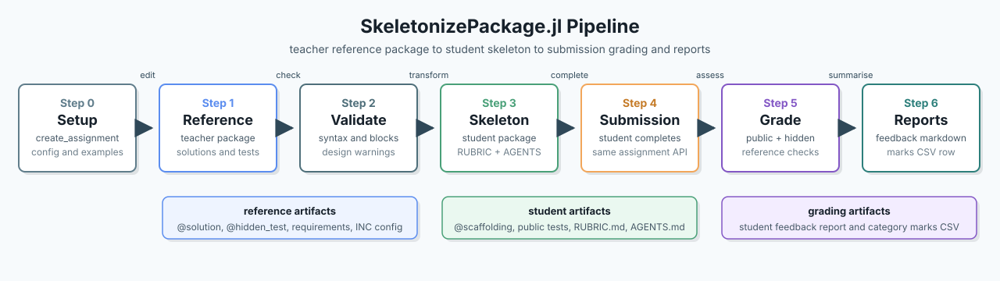
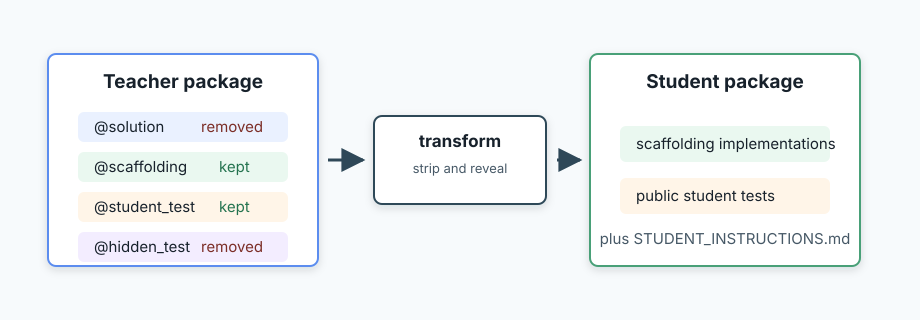
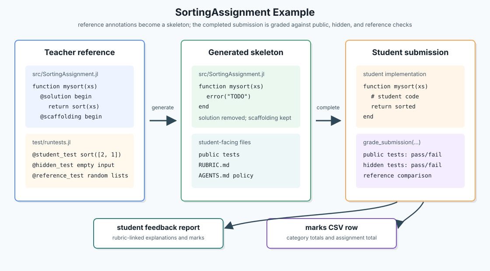

# SkeletonizePackage.jl

[](https://github.com/mroughan/SkeletonizePackage.jl/actions/workflows/CI.yml)
[](https://github.com/mroughan/SkeletonizePackage.jl/actions/workflows/Aqua.yml)
[](https://github.com/mroughan/SkeletonizePackage.jl/actions/workflows/JET.yml)
[](https://github.com/mroughan/SkeletonizePackage.jl/actions/workflows/documentation.yml)
[](https://mroughan.github.io/SkeletonizePackage.jl/dev/)
[](https://codecov.io/gh/mroughan/SkeletonizePackage.jl)
[](https://julialang.org/)
[](LICENSE)

`SkeletonizePackage.jl` is a teaching-oriented metapackage for transforming a
teacher reference package into a student skeleton package. Students complete the
skeleton to create their submission package.

## Features 

- Step 0 teacher scaffolding with `create_assignment(...)` or the `init` CLI
  command.
- Reference-to-skeleton transformation using `@solution`, `@scaffolding`,
  `@student_test`, and `@hidden_test`.
- Generated `STUDENT_INSTRUCTIONS.md`, `RUBRIC.md`, and configurable
  `AGENTS.md` AI-use policy files.
- Rubric marks, required/forbidden code properties, and whole-assignment
  zeroing gates with `zero_marks=true`.
- Stable rubric IDs, per-criterion grading results, and teacher-facing
  `GRADING_PLAN.md` / `TEACHER_CHECKLIST.md` files.
- Hidden reference-oracle tests that compare submissions with the teacher
  implementation.
- Student feedback reports and CSV mark rows for class-scale grading.
- Separate CI checks for package tests, Aqua quality checks, and JET static
  analysis on Julia 1.12.

## Quick start

From Julia, start by creating a teacher reference package template, then run the
pipeline on the included reference example:

```julia
using SkeletonizePackage

create_assignment("MyAssignment"; ai_policy=:recorded)

reference = "examples/SortingAssignment"
skeleton = "SortingAssignmentSkeleton"
submission = "SortingAssignmentSubmission"

validate_reference_package(reference; io=stdout)
generate_skeleton_package(reference, skeleton; force=true)
grade_submission(
    reference,
    submission;
    student_id="s123",
    report_path="s123-feedback.md",
    csv_path="marks.csv",
)
```

The generated skeleton keeps scaffolding implementations and public tests, while
removing solution blocks and hidden tests. It also adds
`STUDENT_INSTRUCTIONS.md`, a generic guide for students who are new to Julia
packages, local environments, dependency installation, and running tests. It
also writes `AGENTS.md`, which records the teacher's AI-use policy for the
assignment.

If the skeleton destination already exists, pass `force=true`:

```julia
generate_skeleton_package("examples/SortingAssignment", "SortingAssignmentSkeleton"; force=true)
```

You can also validate the reference package before generating:

```julia
report = validate_reference_package("examples/SortingAssignment"; io=stdout)
isvalid(report)
```

Or use the small command-line entry point:

```bash
julia --project -e 'using SkeletonizePackage; exit(SkeletonizePackage.main())' -- validate examples/SortingAssignment
julia --project -e 'using SkeletonizePackage; exit(SkeletonizePackage.main())' -- generate examples/SortingAssignment SortingAssignmentSkeleton --force --ai-policy recorded
julia --project -e 'using SkeletonizePackage; exit(SkeletonizePackage.main())' -- grade examples/SortingAssignment SortingAssignmentSubmission --student-id s123 --report s123-feedback.md --csv marks.csv
```



At generation time, `SkeletonizePackage.jl` keeps student-facing scaffolding in
the skeleton and removes teacher-only reference material:



## Teacher annotations

```julia
function mysort(xs)
    @solution begin
        return sort(xs)
    end
    @scaffolding begin
        error("TODO: implement mysort")
    end
end
```

Supported annotation openers must appear on their own line:

```julia
@solution begin
    # teacher-only body
end
```

Inline annotation forms are reported by `validate_reference_package` and are not
transformed.

Visible and hidden tests can be marked similarly:

```julia
@student_test begin
    @marks 1 "sorts a simple input" id="sort-simple"
    @test mysort([2,1]) == [1,2]
end

@hidden_test begin
    @marks 1 "handles a longer hidden input" id="sort-hidden-longer"
    @test mysort([3,1,2]) == [1,2,3]
end
```

`@marks` is rubric metadata. It is a runtime no-op, but generated skeleton
packages include a `RUBRIC.md` file summarizing public and hidden grading
criteria without revealing hidden test code.

Broader code requirements can be grouped similarly:

```julia
@assignment_requirements begin
    @require exported(mysort)
    @require docstring(mysort) marks=1 id="mysort-docstring" "documents mysort"
    @forbid imports(DataFrames) zero_marks=true "does not use a shortcut package"
    @reference_test mysort generator=1:10
end
```

`id="..."` gives a criterion a stable identifier in `RUBRIC.md`, feedback, and
the teacher grading plan. `marks=N` assigns marks to a required or forbidden
property. `zero_marks=true` makes the property a whole-assignment gate: if it
fails during grading, the student gets zero for the assignment.

Reference tests can compare a submission against the teacher implementation
during grading:

```julia
@hidden_test begin
    @marks 3 "matches the reference implementation on generated inputs"
    @reference_test clamp01 generator=[-2, -0.5, 0, 0.25, 1, 2]
end
```

See `examples/ReferenceOracleAssignment` for a complete package using this
pattern.

The included `SortingAssignment` example shows how the same annotations affect
both source code and tests:



Then generate the skeleton version:

```julia
using SkeletonizePackage

generate_skeleton_package("SortingAssignment", "SortingAssignmentSkeleton"; force=true)
```

After students submit completed packages, grade each submission against the same
reference package:

```julia
grade_submission(
    "SortingAssignment",
    "SortingAssignmentSubmission";
    student_id="s123",
    report_path="s123-feedback.md",
    csv_path="marks.csv",
)
```

## Examples

See `examples/SortingAssignment` for a minimal annotated reference package. It
contains:

- `@solution` code that runs in the reference package.
- `@scaffolding` code that appears in the generated skeleton package.
- `@student_test` tests that students can see.
- `@hidden_test` tests that teachers can keep for grading.
- `@marks` metadata that appears in the generated `RUBRIC.md`.
- stable rubric IDs and teacher-facing `GRADING_PLAN.md` /
  `TEACHER_CHECKLIST.md` files when using the scaffold.

To create a new reference package template as step 0 of the pipeline:

```julia
create_assignment("MyAssignment"; ai_policy=:recorded)
```

This writes a small package template, `README.md`, `student_notes.md`, public
and hidden tests, rubric/property/reference-test examples, and a
`SkeletonizePackage.inc` config file. The config can be used directly:

```julia
generate_skeleton_package("MyAssignment/SkeletonizePackage.inc")
```

The config can also include exercise-specific student instructions:

```text
---
[assignment]
reference_path = "."
skeleton_path = "../MyAssignmentStudent"
instructions_path = "student_notes.md"
ai_policy = "recorded"
---
config
assignment
```

When `instructions_path` is set, that Markdown file is appended to the generated
`STUDENT_INSTRUCTIONS.md` under an "Exercise-Specific Instructions" heading.
Annotation blocks in the Markdown file are transformed in student mode, so
`@scaffolding` content is kept and `@solution` content is removed.

`ai_policy` controls the generated `AGENTS.md` file. It can be:

- `forbidden`: AI agents and AI coding assistants are strictly forbidden.
- `recorded`: AI use is permitted only when actions, prompts, outputs, and file
  changes are recorded for audit.
- `allowed`: AI use is allowed, while students remain responsible for
  correctness and academic-integrity requirements.

## Grading outputs

`grade_submission(reference_path, submission_path)` grades a student submission
against the reference package rubric. The returned `GradeResult` includes:

- `student_report`: Markdown feedback for the student, including test output and
  marks summarized against the rubric.
- `csv_header` and `csv_row`: a one-row marks summary suitable for concatenating
  into a larger CSV file with one row per student.

The CLI can write both outputs:

```bash
julia --project -e 'using SkeletonizePackage; exit(SkeletonizePackage.main())' -- grade ReferencePackage SubmissionPackage --student-id s123 --report s123-feedback.md --csv marks.csv
```

## Current status

This is still an early package, but it now validates reference packages before
generation and reports both blocking transformation errors and teaching-design
warnings. Validation also checks that Julia source parses before and after
annotation removal. The transformer remains conservative: annotation macros must
appear on their own line. Future versions may replace the text transformer with
a concrete syntax tree transformation using `JuliaSyntax.jl` or a similar parser.

## AI use disclosure

This package includes documentation, tests, and project scaffolding that were
drafted or revised with assistance from OpenAI's Codex. Human review remains
responsible for correctness, package design, and release decisions.
